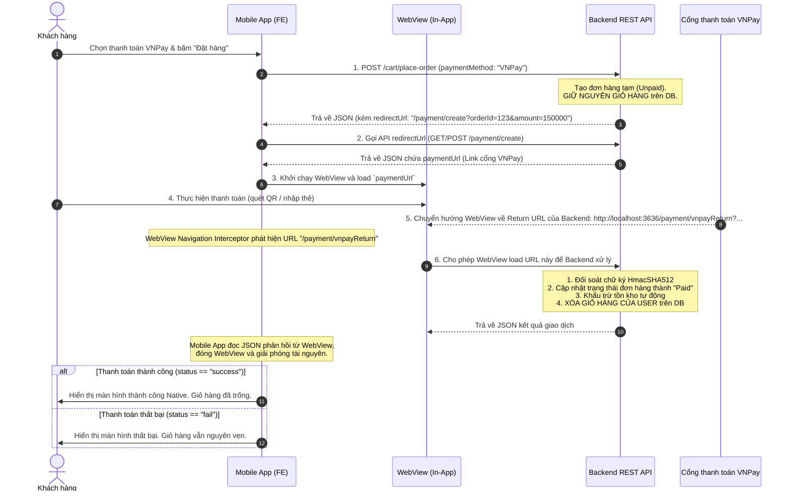

# Tài Liệu Tích Hợp Cổng Thanh Toán VNPay Cho Mobile Frontend (React Native, Flutter, Native App)

Tài liệu này đặc tả chi tiết quy trình tích hợp cổng thanh toán VNPay trên Mobile Frontend (FE), kết hợp cơ chế xử lý giỏ hàng thông minh (chỉ xóa giỏ hàng khi xác nhận thanh toán thành công).

---

## 1. Sơ Đồ Quy Trình Nghiệp Vụ (Mermaid Diagram)

Dưới đây là sơ đồ tương tác giữa **Mobile App (FE)**, **Máy chủ (Backend REST API)** và **Cổng thanh toán VNPay**:



---

## 2. Chi Tiết Các Bước Triển Khai Trên Mobile Frontend (FE)

### Bước 1: Khởi tạo Đơn hàng (Place Order)
Khi người dùng bấm "Đặt hàng", Mobile FE gọi API để khởi tạo đơn hàng:
*   **Method**: `POST`
*   **URL**: `/cart/place-order`
*   **Headers**: Kèm Cookie Session ID của tài khoản đang đăng nhập.
*   **Body (JSON)**:
    ```json
    {
      "paymentMethod": "VNPay"
    }
    ```
*   **Response (200 OK)**:
    ```json
    {
      "message": "Đặt hàng thành công!",
      "paymentMethod": "VNPay",
      "redirectUrl": "/payment/create?orderId=123&amount=150000",
      "order": {
        "orderId": 123,
        "totalPrice": 150000.0,
        "orderStatus": "Pending",
        "paymentStatus": "Unpaid",
        "paymentMethod": "VNPay",
        "createdAt": "2026-06-11T14:50:00"
      }
    }
    ```
> [!NOTE]
> Ở bước này, Backend đã tạo đơn hàng tạm thời nhưng **chưa xóa giỏ hàng** của người dùng trong cơ sở dữ liệu.

---

### Bước 2: Lấy liên kết thanh toán VNPay (paymentUrl)
Mobile App lấy giá trị `redirectUrl` nhận được từ Bước 1 và gọi Backend để tạo URL thanh toán. Trong môi trường sandbox hiện tại, không thêm `bankCode=VNPAYQR` vì merchant test có thể chưa hỗ trợ phương thức này:
*   **Method**: `POST` hoặc `GET`
*   **URL**: `/payment/create?orderId=123&amount=150000`
*   **URL test ngân hàng nội địa**: `/payment/create?orderId=123&amount=150000&bankCode=NCB`
*   **Response (200 OK)**:
    ```json
    {
      "paymentUrl": "https://sandbox.vnpayment.vn/paymentv2/vpcpay.html?vnp_Amount=15000000&vnp_Command=pay&vnp_TxnRef=123_1718114000000&..."
    }
    ```

---

### Bước 3: Khởi chạy In-App WebView & Đánh chặn URL (Navigation Intercept)
Mobile App cần mở một WebView nội bộ để tải URL `paymentUrl` trên. Cần cấu hình WebView lắng nghe mọi sự kiện chuyển trang để đánh chặn sự kiện kết thúc.

#### 1. Trường hợp thanh toán thành công hoặc thất bại thông thường (Có callback từ VNPay):
*   Khi WebView chuyển hướng sang URL chứa chuỗi `/payment/vnpayReturn` (Ví dụ: `http://localhost:3636/payment/vnpayReturn?vnp_Amount=...`):
    1.  **Cho phép WebView tải xong trang này** để Backend thực hiện xử lý (Backend sẽ đối soát chữ ký, cập nhật trạng thái đơn hàng thành `Paid`, trừ kho sản phẩm và xóa giỏ hàng của tài khoản).
    2.  **Đọc nội dung phản hồi JSON** từ trang web vừa tải xong.
    3.  **Tắt WebView**.
    4.  Nếu JSON trả về là `{"status": "success", ...}`: Chuyển sang màn hình **Thành công** dạng Native.
    5.  Nếu JSON trả về là `{"status": "fail", ...}`: Chuyển sang màn hình **Thất bại** dạng Native (Giỏ hàng của người dùng vẫn còn nguyên, cho phép họ quay lại sửa đổi hoặc thanh toán lại).

#### 2. Trường hợp người dùng chủ động Hủy thanh toán (Tắt WebView thủ công):
*   Nếu người dùng bấm nút **Đóng (X)** hoặc nút **Back** của điện thoại để đóng WebView khi chưa hoàn tất thanh toán:
    1.  Tắt WebView lập tức.
    2.  Đưa người dùng quay lại màn hình giỏ hàng hoặc chi tiết đơn hàng (Giỏ hàng của người dùng vẫn được bảo toàn nguyên vẹn trên Database do Backend chưa nhận được lệnh callback thành công từ VNPay).

---

## 3. Mã Nguồn Mẫu Đánh Chặn (WebView Navigation Interception)

### 3.1. Ví dụ với React Native (`react-native-webview`)
```javascript
import React, { useRef } from 'react';
import { SafeAreaView, ActivityIndicator } from 'react-native';
import { WebView } from 'react-native-webview';

const VNPayWebView = ({ paymentUrl, onPaymentSuccess, onPaymentFail, onUserCancel }) => {
  const webViewRef = useRef(null);

  const handleNavigationStateChange = (navState) => {
    const { url } = navState;

    // Phát hiện trang kết quả vnpayReturn của Backend
    if (url.includes('payment/vnpayReturn')) {
      // Dừng việc load tiếp URL
      webViewRef.current.stopLoading();

      // Đọc nội dung JSON trả về từ Backend (thông qua inject javascript hoặc gọi API đối soát trực tiếp)
      // Thông thường, ta có thể inject JS để lấy document.body.innerText chứa JSON phản hồi của REST API
      webViewRef.current.injectJavaScript(`
        window.ReactNativeWebView.postMessage(document.body.innerText);
      `);
    }
  };

  const handleMessage = (event) => {
    try {
      const responseData = JSON.parse(event.nativeEvent.data);
      if (responseData.status === 'success') {
        onPaymentSuccess(responseData);
      } else {
        onPaymentFail(responseData);
      }
    } catch (e) {
      onPaymentFail({ message: 'Lỗi parse dữ liệu kết quả!' });
    }
  };

  return (
    <SafeAreaView style={{ flex: 1 }}>
      <WebView
        ref={webViewRef}
        source={{ uri: paymentUrl }}
        onNavigationStateChange={handleNavigationStateChange}
        onMessage={handleMessage}
        startInLoadingState={true}
        renderLoading={() => <ActivityIndicator size="large" style={{ flex: 1 }} />}
      />
    </SafeAreaView>
  );
};
```

### 3.2. Ví dụ với Flutter (`webview_flutter`)
```dart
import 'dart:convert';
import 'package:flutter/material.dart';
import 'package:webview_flutter/webview_flutter.dart';

class VNPayWebViewPage extends StatefulWidget {
  final String paymentUrl;
  final Function(Map<String, dynamic>) onPaymentSuccess;
  final Function(Map<String, dynamic>) onPaymentFail;

  const VNPayWebViewPage({
    Key? key,
    required this.paymentUrl,
    required this.onPaymentSuccess,
    required this.onPaymentFail,
  }) : super(key: key);

  @override
  State<VNPayWebViewPage> createState() => _VNPayWebViewPageState();
}

class _VNPayWebViewPageState extends State<VNPayWebViewPage> {
  late final WebViewController _controller;

  @override
  void initState() {
    super.initState();
    _controller = WebViewController()
      ..setJavaScriptMode(JavaScriptMode.unrestricted)
      ..setNavigationDelegate(
        NavigationDelegate(
          onNavigationRequest: (NavigationRequest request) async {
            // Phát hiện URL Return từ Backend
            if (request.url.contains('payment/vnpayReturn')) {
              // Đợi trang load xong để Backend xử lý
              return NavigationDecision.navigate;
            }
            return NavigationDecision.navigate;
          },
          onPageFinished: (String url) async {
            if (url.contains('payment/vnpayReturn')) {
              // Lấy nội dung JSON từ phản hồi của Backend
              final String responseText = await _controller.runJavaScriptReturningResult(
                "document.body.innerText"
              ) as String;

              // Giải mã chuỗi JSON (trong một số môi trường có thể bị bao bởi dấu nháy kép thừa)
              String cleanJson = responseText;
              if (cleanJson.startsWith('"') && cleanJson.endsWith('"')) {
                cleanJson = cleanJson.substring(1, cleanJson.length - 1).replaceAll('\\"', '"');
              }

              try {
                final Map<String, dynamic> result = jsonDecode(cleanJson);
                if (result['status'] == 'success') {
                  widget.onPaymentSuccess(result);
                } else {
                  widget.onPaymentFail(result);
                }
              } catch (e) {
                widget.onPaymentFail({'message': 'Lỗi xử lý dữ liệu!'});
              }
            }
          },
        ),
      )
      ..loadRequest(Uri.parse(widget.paymentUrl));
  }

  @override
  Widget build(BuildContext context) {
    return Scaffold(
      appBar: AppBar(title: const Text('Thanh Toán VNPay')),
      body: WebViewWidget(controller: _controller),
    );
  }
}
```

---

## 4. Quản Lý Trạng Thái Của Đơn Hàng & Giỏ Hàng (State Lifecycle)

| Kịch bản | Trạng thái Đơn hàng (`orderStatus`) | Trạng thái Thanh toán (`paymentStatus`) | Giỏ hàng trong DB (`cart_items`) | Hành động trên FE |
| :--- | :--- | :--- | :--- | :--- |
| **Khởi tạo đơn hàng** | `Pending` | `Unpaid` | **Giữ nguyên** | Chuyển tiếp sang mở WebView VNPay |
| **Giao dịch thành công** | `PENDING` | `Paid` | **Đã xóa sạch** | Đóng WebView, hiển thị màn hình chúc mừng. |
| **Giao dịch thất bại / Từ chối** | `Pending` | `Unpaid` | **Giữ nguyên** | Đóng WebView, hiển thị trang báo lỗi và nút thử lại. |
| **Người dùng hủy (Đóng WebView)** | `Pending` | `Unpaid` | **Giữ nguyên** | Đóng WebView, cho phép người dùng vào lại Giỏ hàng để mua sắm tiếp hoặc đổi món. |
